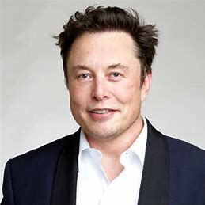

# 🌟 자기소개서 (Future Resume)🌟
## 이름
**이민재(MINJAE-LEE)**
## 📧 이메일
**dbdlsgml5@naver.com**
## 주소
**[깃허브](https://github.com/dlalswo0619)**
## 🚀 간략한 자기소개 (희망직무)
💡 *21세기 최고의 소프트웨어 엔지니어이자 인류 역사를 바꾼 혁신가로 평가, 제2의 앨런튜링, 스티브잡스로 불리는 남자*  
🌍 AI, 양자 컴퓨팅, 블록체인, 보안, 우주 기술 등 여러 분야에 지대한 영향을 끼치며 기술의 경계를 확장하는 중. 실리콘밸리와 글로벌 기업들이 기술 컨설팅을 받기 위해 줄을 서며, 새로운 패러다임을 제시하는 개발자로 평가받음. 현대 소프트웨어 개발의 표준을 재정의하고 있음.  
>🤖 현재 AI 개발분야에서의 직무를 희망 중
## 교육  
| 학교 | 전공 | 졸업연도 |   
|---|---|---|   
| 🎓 **광운대학교** | 정보융합학부 | 2026년 |   
| 🎓 **MIT** | 컴퓨터공학 석·박사 | 2030년 |   
| 🛰 **NASA 연구소** | 연구원 | 2032년 |   
## 💼 인턴경력
- **Google DeepMind** 
  - ✅ 차세대 AI 모델 프로젝트 리드  
  - ✅ 강화학습 기반 초지능 AI 설계 및 구현  
- **Tesla Autopilot Team**
  - ✅ 인공지능을 활용한 완전 자율주행 시스템 개발  
  - ✅ 차량-뇌 인터페이스 제작, 상용화로 큰 이득을 가져옴  
- **NASA**
  - ✅ 양자 컴퓨터를 활용한 우주 탐사 AI 모델 개발  
  - ✅ 화성 탐사 AI 프로젝트   
## 🏆 프로젝트 경험
### 🧠 Brain-Computer Interface 2.0 
- 🔥뇌파와 컴퓨터를 연결하는 새로운 타입의 인터페이스 개발 성공
- 🔥운전면허 없이 차를 끄는 신세계를 열었다 평가받는 프로젝트
### 🔗 Quantum Blockchain Network
- 🔥 양자 컴퓨팅을 활용한 세계 최초 해킹 불가능한 블록체인 구축  
- 🔥 전 세계 금융 시스템의 보안 프로토콜로 채택  
### 📱 광운대 정보융합학부 팀프로젝트
- 🔥모바일 어플리케이션 '팡팡그램'을 개발
- 🔥광운대 학생들의 여가시간을 책임지는 앱 TOP1(정보융합학부 5인 설문)
## 📜 자격증
- 🎖 **Google Professional Cloud Architect** *(2027년 취득)*
- 🎖 **AWS Certified Solutions Architect – Professional** *(2028년 취득)*
- 🎖 **NVIDIA Deep Learning Institute Certificate** *(2029년 취득)*
- 🎖 **Microsoft Certified: Azure Solutions Architect Expert** *(2030년 취득)*
- 🎖 **NASA Quantum Computing Specialist** *(2031년 취득)*
- 🎖 **SpaceX Certified Interplanetary Software Engineer** *(2032년 취득)*
## 🏅 수상
```diff
🏆 Turing Award (2033년)
🏆 Google Code Jam 우승 (2026~2031년 – 5년 연속)
🏆 ICPC 세계대회 우승 (2027년, 2028년)
🏆 IEEE AI Innovation Award (2031년)
🏆 세계 최초로 생겨난 노벨 컴퓨터 과학상 (2031년)
```
## 🌟 기타 활동
- 🎤 **TED 강연: "AI가 바꿀 미래"**
- 🌍 **Forbes 선정: "30 Under 30" IT 부문 포함**
- 🔬 **MIT Technology Review 선정: "혁신가 35인"**
- 🚀 **SpaceX & NASA 협업 프로젝트 연구원**
- 🏛 **국제 표준 개발자로서 W3C, ISO, IEEE 등에서 활동 중**  
- 📺 **세바시(세상을 바꾸는 시간, 15분 ) 강연으로 시청률 50퍼를 넘기며 화제**
- 📄 **뉴욕타임즈 선정 21세기 2분기 가장 영향력이 큰 인물 TOP1**
---
   
테슬라 CEO 일론머스크 "내가 minjae를 영입한건 내 인생 최고의 결정이다"

*미래를 상상하며 작성한 내용입니다..*
